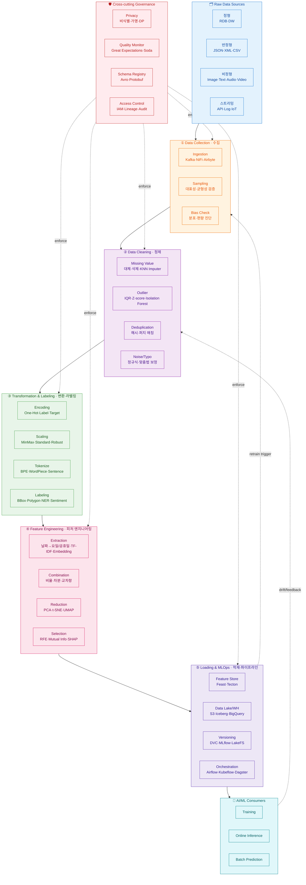

# AI-Ready 데이터 가공 파이프라인

> 인공지능(AI)·머신러닝(ML) 모델이 **추가적인 전처리 없이 즉시 학습·예측에 사용**할 수 있도록
> 데이터를 정제·구조화하는 일련의 과정.
>
> *"데이터가 새 시대의 원유라면, AI-Ready 가공은 원유를 자동차에 바로 넣을 수 있는 휘발유로 만드는 정제 과정"*

---

## 📊 파이프라인 다이어그램 (Mermaid)



---

## 🖼️ 파이프라인 다이어그램 (ASCII)

```
╔══════════════════════════════════════════════════════════════════════════════╗
║                    AI-Ready 데이터 가공 파이프라인                           ║
╚══════════════════════════════════════════════════════════════════════════════╝

  🗂️  RAW DATA SOURCES
  ┌──────────┬──────────────┬────────────────────┬──────────────┐
  │   정형   │   반정형     │      비정형        │  스트리밍    │
  │ RDB / DW │ JSON/XML/CSV │ Image/Text/A/V     │ API/Log/IoT  │
  └────┬─────┴──────┬───────┴─────────┬──────────┴──────┬───────┘
       └────────────┴─────────────────┴─────────────────┘
                                │
       ┌────────────────────────▼────────────────────────┐
       │ ① Data Collection · 수집                        │
       │   • Ingestion (Kafka / NiFi / Airbyte)          │
       │   • 대표성·균형성 샘플링 · Bias 진단            │
       └────────────────────────┬────────────────────────┘
                                ▼
       ┌─────────────────────────────────────────────────┐
       │ ② Data Cleaning · 정제                          │
       │   ┌─결측치──┐ ┌─이상치──┐ ┌─중복────┐ ┌─노이즈─┐│
       │   │ KNN 대체│ │ IQR/Z   │ │ Hash    │ │ Regex  ││
       │   │ 평균/중앙│ │IsoForest│ │ Fuzzy   │ │ Spell  ││
       │   └─────────┘ └─────────┘ └─────────┘ └────────┘│
       └────────────────────────┬────────────────────────┘
                                ▼
       ┌─────────────────────────────────────────────────┐
       │ ③ Transformation & Labeling · 변환·라벨링       │
       │   [정형]   Encoding (OneHot/Label/Target)       │
       │           Scaling  (MinMax/Standard/Robust)     │
       │   [텍스트] Tokenization (BPE/WordPiece)         │
       │   [이미지] BBox / Polygon / Segmentation        │
       │   [텍스트] NER / 감정태깅 / 의도분류            │
       └────────────────────────┬────────────────────────┘
                                ▼
       ┌─────────────────────────────────────────────────┐
       │ ④ Feature Engineering · 피처 엔지니어링         │
       │   • Extraction : 날짜→요일/공휴일, TF-IDF, Embed│
       │   • Combination: 비율, 차분, 교차항, 윈도우집계 │
       │   • Reduction  : PCA, t-SNE, UMAP, AutoEncoder  │
       │   • Selection  : RFE, MI, SHAP, L1 Regularize   │
       └────────────────────────┬────────────────────────┘
                                ▼
       ┌─────────────────────────────────────────────────┐
       │ ⑤ Loading & MLOps · 적재·파이프라인             │
       │   ┌──────────────┐  ┌──────────────────────┐    │
       │   │Feature Store │  │ Data Lake / Warehouse│    │
       │   │ Feast/Tecton │  │ S3·Iceberg·BigQuery  │    │
       │   └──────┬───────┘  └──────────┬───────────┘    │
       │   ┌──────▼───────┐  ┌──────────▼───────────┐    │
       │   │ Versioning   │  │ Orchestration        │    │
       │   │ DVC / MLflow │  │ Airflow/Kubeflow     │    │
       │   └──────────────┘  └──────────────────────┘    │
       └────────────────────────┬────────────────────────┘
                                ▼
            🤖 AI / ML  ─────────────────────────────
            ├─ Training       (학습)
            ├─ Online Serving (실시간 추론)
            └─ Batch Predict  (배치 예측)
                ▲
                │  drift / feedback
                └────── 재학습 트리거 ──┐
                                        │
  ╔════════════════════════════════════════════════════════════════════════╗
  ║ 🛡️  Cross-cutting Governance (전 단계 횡단)                           ║
  ║  Privacy(비식별·가명·DP) │ Quality(GE·Soda) │ Schema │ IAM/Lineage     ║
  ╚════════════════════════════════════════════════════════════════════════╝
```

---

## 🛠️ 단계별 상세

### ① Data Collection · 데이터 수집 및 데이터셋 구성
- **목적**: 흩어진 정형·반정형·비정형 데이터를 한 곳에 모음
- **AI-Ready 요건**: 모델 편향(Bias)을 막기 위한 **다양성·균형성** 확보
- **주요 도구**: Kafka, NiFi, Airbyte, Fluentd, Debezium

### ② Data Cleaning · 데이터 정제
| 작업 | 설명 | 기법 |
|---|---|---|
| 결측치 처리 | 비어 있는 값 보완·제거 | 평균/중앙값, KNN Imputer, MICE |
| 이상치 제거 | 극단값으로 인한 왜곡 방지 | IQR, Z-score, Isolation Forest |
| 중복 제거 | 과적합(Overfitting) 방지 | 정확 매칭, 퍼지 매칭(Levenshtein) |
| 노이즈 제거 | 오탈자·잡음 보정 | 정규식, 맞춤법 검사기 |

### ③ Transformation & Labeling · 데이터 변환 및 라벨링
- **정형 데이터**
  - Encoding: One-Hot, Label, Target, Ordinal
  - Scaling: Min-Max, Standard(Z-score), Robust, Log
- **비정형 데이터 (라벨링 = 정답지 부여)**
  - 이미지: Bounding Box, Polygon, Semantic Segmentation
  - 텍스트: NER, 감정 태깅, 의도 분류, RLHF 선호도
  - 음성: Transcription, Speaker Diarization

### ④ Feature Engineering · 피처 엔지니어링
- **추출(Extraction)**: 날짜 → 요일/공휴일/월말여부, 텍스트 → TF-IDF/Embedding
- **조합(Combination)**: 비율, 차분, 시계열 윈도우 집계, 교차항
- **차원 축소(Reduction)**: PCA, t-SNE, UMAP, AutoEncoder
- **선택(Selection)**: RFE, Mutual Information, SHAP, L1 Regularization

### ⑤ Loading & MLOps · 적재 및 파이프라인 구축
- **Feature Store**: Feast, Tecton (학습-서빙 일관성 보장)
- **Data Lake/Warehouse**: S3 + Iceberg, BigQuery, Snowflake
- **Versioning**: DVC, MLflow, LakeFS (재현성)
- **Orchestration**: Airflow, Kubeflow, Dagster, Prefect

---

## 🛡️ 횡단 거버넌스 (Cross-cutting Concerns)

모든 단계에 **동시 적용**되어야 하는 요소:

- **Privacy**: 가명화, 익명화, 차등 프라이버시(DP), PII 마스킹
- **Quality Monitoring**: Great Expectations, Soda, 스키마/통계 drift 탐지
- **Schema Registry**: Avro, Protobuf 기반 계약(contract) 관리
- **Access Control & Lineage**: IAM, Data Catalog, 감사 로그

---

## ✅ AI-Ready 체크리스트

| 조건 | 설명 | 검증 방법 |
|---|---|---|
| **일관성 (Consistency)** | 모든 데이터의 형식·단위·스키마가 통일 | 스키마 검증, 단위 통일 테스트 |
| **품질 (Quality)** | 결측·이상·중복·노이즈 제거 완료 | GE/Soda 등 데이터 품질 룰 통과 |
| **접근성 (Accessibility)** | API/SQL/Feature Store로 즉시 호출 가능 | 카탈로그 등록, 권한 부여 |
| **윤리·보안 (Privacy)** | 비식별화·가명처리 완비 | 개인정보 영향평가(PIA), DPIA |
| **재현성 (Reproducible)** | 데이터·코드·모델 버전 고정 | DVC/MLflow 태깅, lineage 추적 |

---

## 🔁 핵심 포인트

1. **5단계는 순차적이지만, 거버넌스는 횡단(cross-cutting)** — 모든 단계에 동시에 적용됩니다.
2. **피드백 루프가 진짜 파이프라인** — 운영 중 drift 감지 → 정제·수집 단계로 되돌아가는 폐쇄 루프가 핵심.
3. **Feature Store가 학습-서빙 일관성의 열쇠** — training-serving skew 방지의 표준 패턴.
4. **AI 프로젝트 비용의 70~80%가 데이터 가공** — 자동화(MLOps)가 ROI를 좌우합니다.
